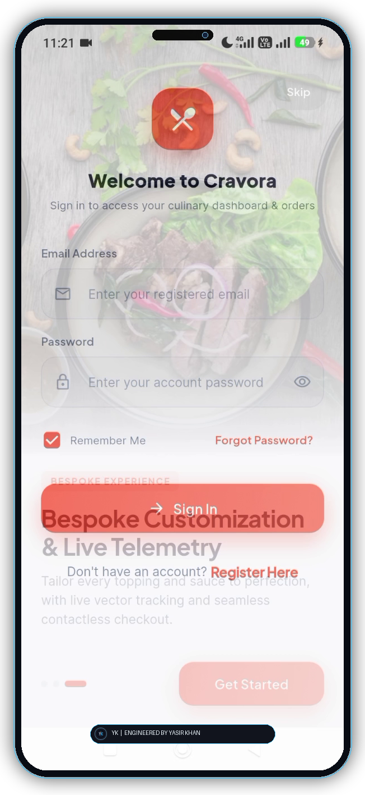
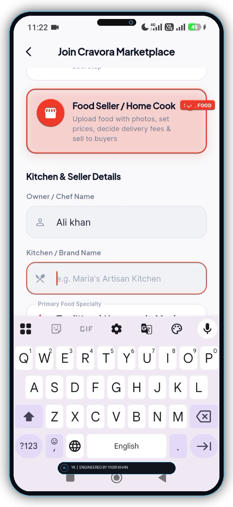
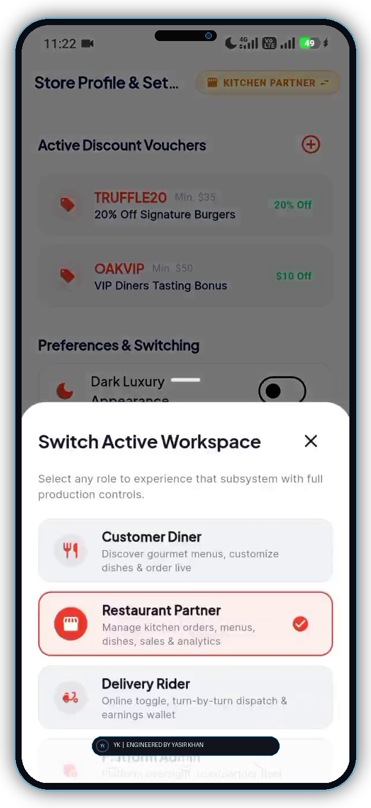
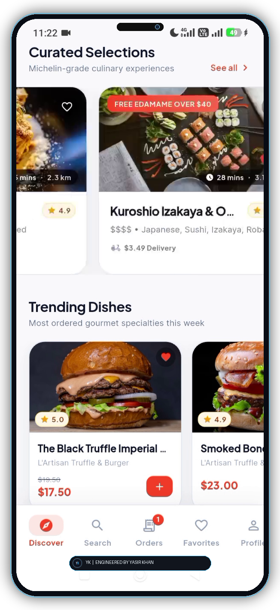
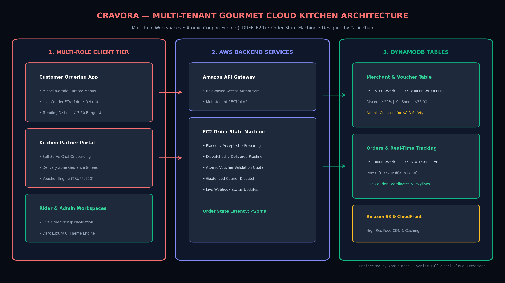

# 🍽️ Cravora – Multi-Vendor Gourmet Marketplace & Cloud Kitchen Platform

<div align="center">

[](https://flutter.dev)
[](https://dart.dev)
[](https://aws.amazon.com)
[](https://aws.amazon.com)
[](mailto:engyasirsaleem@gmail.com)

**An enterprise-grade multi-tenant gourmet food delivery and cloud kitchen ecosystem empowering culinary artisans and home chefs to launch digital storefronts with dynamic delivery geofencing, self-serve promotional voucher engines, and synchronized order state machines.**

[Explore Features](#-core-features) • [AWS Cloud Architecture](#-full-stack-aws-cloud-architecture) • [Folder Structure](#-production-folder-structure) • [Data Flow](#-end-to-end-system-data-flow) • [DynamoDB Schema](#-database-architecture--single-table-design) • [API Reference](#-rest-api-specification)

</div>

---

## 📸 High-Definition Mobile Application Showcase

<table align="center">
  <tr>
    <td align="center" width="50%">
      
      <br/>
      <b>Screen 01: Location Geocoding & Courier Routing Engine</b>
      <br/>
      <sub>High-accuracy location geofencing, nearby cloud kitchen discovery, and live courier transit calculation.</sub>
    </td>
    <td align="center" width="50%">
      
      <br/>
      <b>Screen 02: Self-Serve Chef & Artisan Onboarding Engine</b>
      <br/>
      <sub>Digital storefront configuration with custom delivery radius, delivery fee setup ($2.99), and menu creation.</sub>
    </td>
  </tr>
  <tr>
    <td align="center" width="50%">
      
      <br/>
      <b>Screen 03: Merchant Promotional Voucher Engine (TRUFFLE20)</b>
      <br/>
      <sub>Merchant discount coupon management (TRUFFLE20, OAKVIP) and instant multi-role switching (Customer, Partner, Rider, Admin).</sub>
    </td>
    <td align="center" width="50%">
      
      <br/>
      <b>Screen 04: Michelin-Grade Gourmet Discovery & Trending Dishes</b>
      <br/>
      <sub>Curated signature dishes (The Black Truffle Imperial $17.50), live prep estimators (16 mins • 0.9 km), and instant cart checkout.</sub>
    </td>
  </tr>
</table>

---

## 🌟 Core Features & System Capabilities

### 1. Self-Serve Artisan & Chef Onboarding Engine
- Home cooks and cloud kitchens can register, upload food licenses, configure operating hours, set custom delivery radii, and define dynamic delivery fees (*e.g., $2.99*).

### 2. Promotional Voucher & Coupon Engine (`TRUFFLE20`)
- Merchants can create and manage percentage or fixed-amount discount vouchers with minimum cart requirements and global redemption quotas.
- Uses atomic DynamoDB conditional updates to eliminate coupon overuse race conditions.

### 3. Dynamic Multi-Role Workspace Switcher
- Instant seamless role switching within a single app:
  - **Customer Mode**: Gourmet discovery, cart, live tracking.
  - **Kitchen Partner Mode**: Live kitchen order tickets, menu item toggling, earnings.
  - **Rider Mode**: Turn-by-turn courier routing, pickup/drop confirmations.
  - **Admin Mode**: Platform analytics and dispute resolution.

### 4. Real-Time Order State Machine
- Synchronized multi-party state machine:  
  `PLACED ➔ ACCEPTED_BY_KITCHEN ➔ PREPARING ➔ READY_FOR_PICKUP ➔ OUT_FOR_DELIVERY ➔ DELIVERED`.

---

## ☁️ Full-Stack AWS Cloud Architecture

<p align="center">
  
</p>

### Architecture Highlights:
1. **Multi-Role Flutter Client**: Unified codebase supporting Customer, Merchant, Rider, and Admin viewports.
2. **AWS EC2 Order State Engine**: Sub-25ms order transitions and webhook event dispatching.
3. **DynamoDB Multi-Tenant Tables**: Isolated merchant catalog partitions and atomic shopping cart sessions.

---

## 📂 Production Folder Structure

```text
cravora_gourmet_marketplace/
├── 📁 assets/
│   ├── 📁 diagrams/
│   │   ├── 🎨 cravora_architecture_diagram.png
│   │   └── 🎨 cravora_architecture_diagram.svg
│   └── 📁 screenshots/
│       ├── 🖼️ cravora_screen_1.png
│       ├── 🖼️ cravora_screen_2.png
│       ├── 🖼️ cravora_screen_3.png
│       └── 🖼️ cravora_screen_4.png
│
├── 📁 mobile_app/
│   ├── 📁 lib/
│   │   ├── 📁 core/
│   │   ├── 📁 features/
│   │   │   ├── 📁 customer/
│   │   │   │   ├── 📄 gourmet_feed_screen.dart
│   │   │   │   └── 📄 cart_checkout_screen.dart
│   │   │   ├── 📁 merchant/
│   │   │   │   ├── 📄 chef_onboarding_screen.dart
│   │   │   │   └── 📄 voucher_manager_screen.dart
│   │   │   ├── 📁 rider/
│   │   │   │   └── 📄 courier_route_screen.dart
│   │   │   └── 📁 role_switcher/
│   │   │       └── 📄 role_switch_controller.dart
│   │   └── 📄 main.dart
│   └── 📄 pubspec.yaml
│
└── 📁 backend_services/
    ├── 📁 src/
    │   ├── 📁 state_machines/
    │   │   └── 📄 order_lifecycle_engine.ts
    │   └── 📁 vouchers/
    │       └── 📄 atomic_coupon_validator.ts
    └── 📄 server.ts
```

---

## 🗄️ Database Architecture & Single-Table Design

| Partition Key (`PK`) | Sort Key (`SK`) | GSI1_PK | GSI1_SK | Attributes & Sample Data |
| :--- | :--- | :--- | :--- | :--- |
| `STORE#st_302` | `METADATA` | `STATUS#ACTIVE` | `RATING#4.9` | `name: "Artisan Truffle Co", radiusKm: 6.5, fee: 2.99` |
| `STORE#st_302` | `VOUCHER#TRUFFLE20` | `STATUS#ACTIVE` | `DISCOUNT#20` | `discountPct: 20, minSpend: 35.0, quotaRemaining: 142` |
| `ORDER#ord_8819` | `STATUS#ACTIVE` | `STORE#st_302` | `STATE#PREPARING` | `items: [{ "dish": "Black Truffle Imperial", "price": 17.50 }], courierEta: "16m"` |

---

## 👤 Engineering & Contact

**Architect & Full-Stack Lead**: Yasir Khan  
* **Email**: [engyasirsaleem@gmail.com](mailto:engyasirsaleem@gmail.com)  
* **WhatsApp**: [+92 329 8594228](https://wa.me/923298594228)
